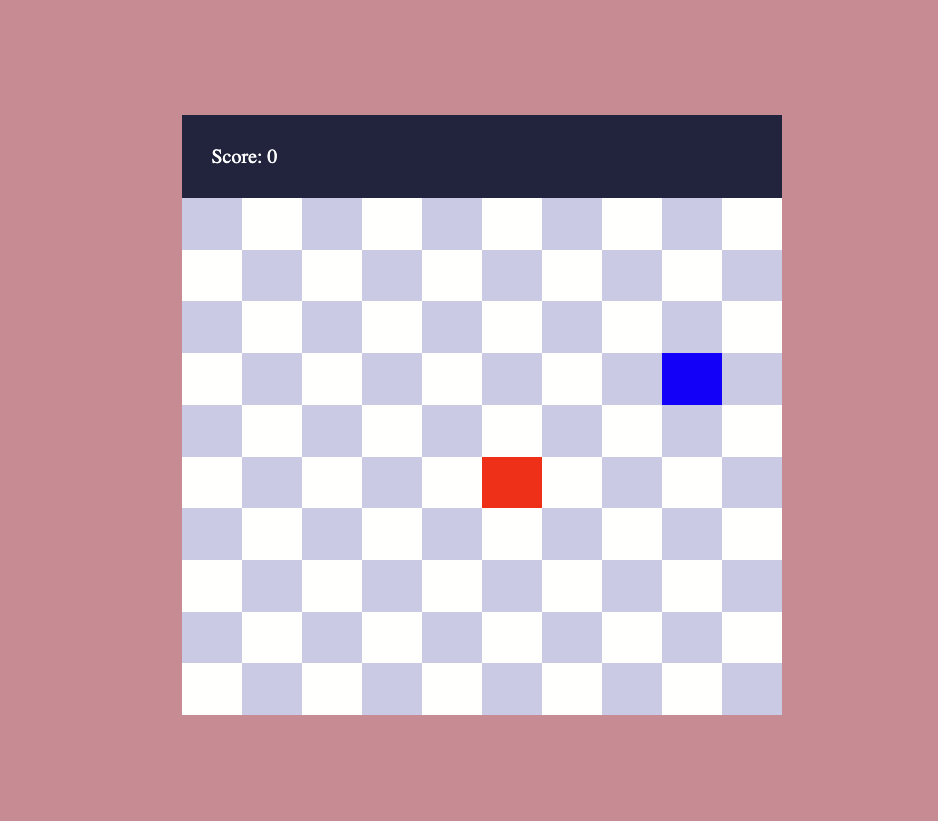

# Snake Game
Remake of the classic Snake game using HTML, CSS, and JavaScript. 

## Features

- Score Tracking: Keeps track of your score throughout the game, updating in real-time as you eat food.
- Game Over Detection: The game ends when the snake hits the boundaries or itself, with a prompt to restart the game.
- You can change the gird size and snake's speed to make it more interesting

## How to Play
- **Control the Snake**: Use the arrow keys on your keyboard to change the direction of the snake.
- **Up Arrow**: Move up
- **Down Arrow**: Move down
- **Left Arrow**: Move left
- **Right Arrow**: Move right
- **Objective**: Eat as many food items as possible to increase your score. Each food item eaten will increase your score by one point.

